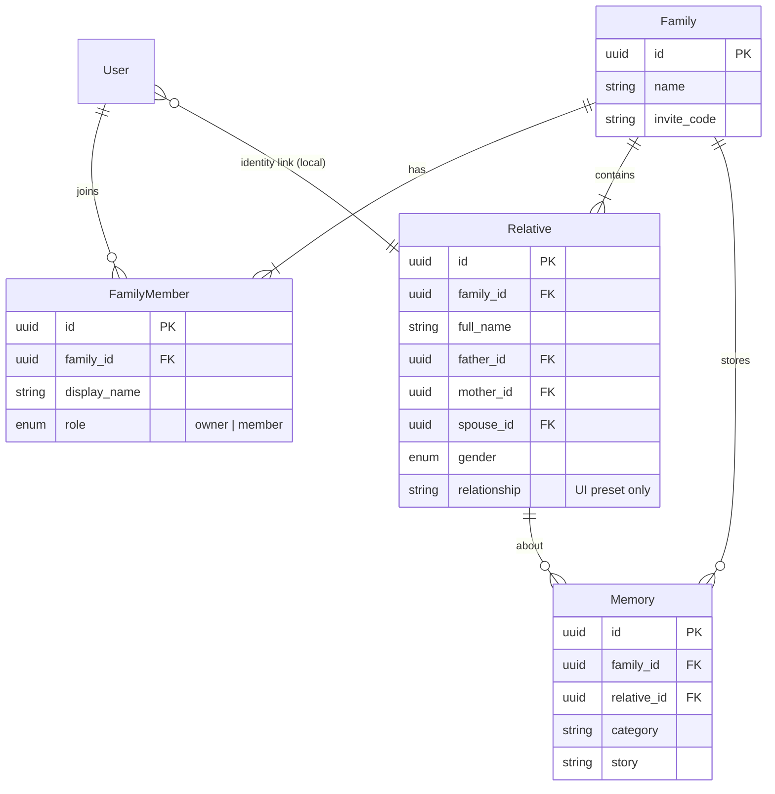
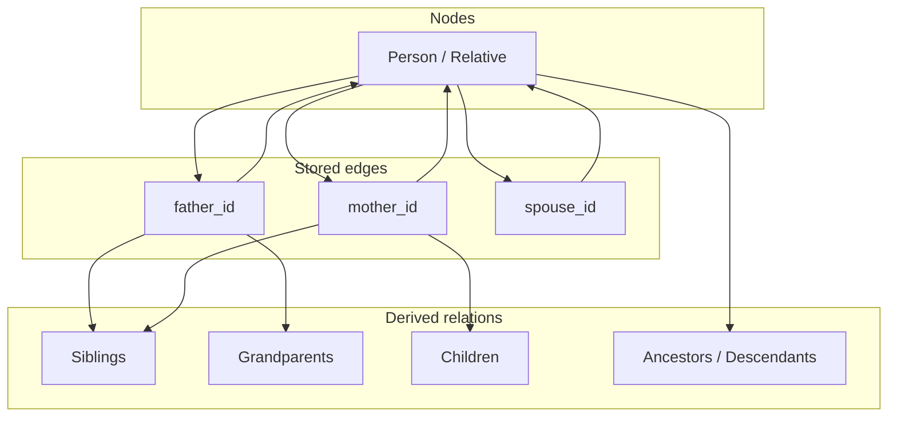
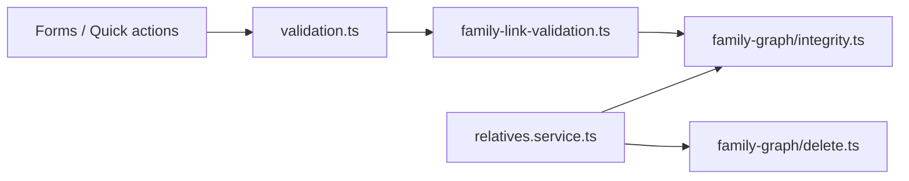
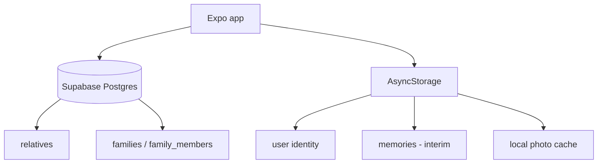

# Shezhire (Shanyraq Family) — Architecture

> **Status:** Living document · v1.0  
> **Product:** Digital Kazakh Shezhire — family memory, lineage, and kinship  
> **Codebase:** `shanyraq-family` (Expo / React Native / TypeScript / Supabase)

This document defines the long-term architecture of Shezhire before complexity grows further. It separates **what we store** (structural truth) from **what we compute** (kinship, UI, narratives) and describes how the system scales across generations and users.

---

## Table of Contents

1. [Vision](#1-vision)
2. [Core Principles](#2-core-principles)
3. [Domain Model](#3-domain-model)
4. [Graph Architecture](#4-graph-architecture)
5. [Kinship Engine](#5-kinship-engine)
6. [Integrity Layer](#6-integrity-layer)
7. [Multi-user Architecture](#7-multi-user-architecture)
8. [Future Roadmap](#8-future-roadmap)
9. [Technical Stack](#9-technical-stack)
10. [Folder Structure](#10-folder-structure)
11. [Testing Strategy](#11-testing-strategy)
12. [Scalability Considerations](#12-scalability-considerations)

---

## 1. Vision

Shezhire is a **digital Kazakh Shezhire platform**: a calm, trustworthy place where families preserve lineage, remember elders, and navigate multi-generation relationships.

| Pillar | Description |
|--------|-------------|
| **Family memory** | Stories, photos, advice, voice notes, and documents attached to people and moments — not scattered in chats. |
| **Lineage** | A multi-generation family graph rooted in explicit parent and spouse links, not surname guessing. |
| **Kinship system** | Kazakh kinship terms (жеңге, нағашы, жиен, …) computed from a chosen root person and the graph — never hard-coded per person. |
| **Shezhire tree** | An interactive, focus-based tree UI where any relative can become the center; labels update dynamically. |

**North star:** A family can grow the tree for decades — hundreds of relatives, multiple branches, several active users — without the graph becoming inconsistent or the UX becoming confusing.

---

## 2. Core Principles

These principles are non-negotiable. They protect correctness as features accumulate.

### 2.1 Structural links only

The database stores **only** explicit structural relationships:

| Field | Meaning |
|-------|---------|
| `father_id` | Biological/legal father link (nullable) |
| `mother_id` | Biological/legal mother link (nullable) |
| `spouse_id` | Spouse link (nullable; reciprocal sync on write) |

Everything else — siblings, grandparents, cousins, in-laws — is **derived**.

### 2.2 No fake or manual kinship labels

Do **not** persist kinship terms like «нағашы», «көке», «жиен», «бөле» as authoritative data.

- The `relationship` column on `relatives` is a **UI preset / onboarding hint** (e.g. «Мен», «Бала», `father_side_sibling`), not the source of truth for tree logic.
- Shezhire cards display **calculated** kinship lines via `getKinshipCardLine()`.
- When links are incomplete, show **guidance** — never infer from surname, patronymic, or tribe metadata.

### 2.3 Relationships are calculated dynamically

Given:

- `rootPerson` — the focused tree center (may differ from the logged-in user)
- `targetPerson` — any other relative
- `allRelatives[]` — the family graph snapshot

The kinship engine returns a typed result (`KinshipResult`) with Kazakh/Russian labels and optional path steps.

### 2.4 Data integrity first

All writes pass through validation and graph integrity checks:

- No self-links
- No ancestor cycles
- Broken link detection
- Spouse reciprocity
- Safe delete planning before removal

Prefer blocking a bad save over silently corrupting the tree.

### 2.5 Calm Kazakh-first UX

- Primary copy in Kazakh; Russian secondary where helpful.
- Warm empty states instead of technical errors («Алдымен ата-анаңызды қосыңыз»).
- Progressive disclosure in Shezhire (collapsible generations, parent-side sections).
- Helper: «Туыстық атаулар автоматты түрде есептеледі.»

---

## 3. Domain Model

### 3.1 Entity overview



### 3.2 Entities

| Entity | Purpose | Persistence today |
|--------|---------|-------------------|
| **User** | Authenticated app user (Supabase Auth — session via family flow) | Supabase + local session |
| **Relative (Person)** | A node in the family graph | `relatives` table |
| **Family** | Isolated family space (name + invite code) | `families` table |
| **FamilyMember** | User membership in a family (`owner` / `member`) | `family_members` table |
| **RelationshipGraph** | In-memory view over relatives + structural links | Computed (`FamilyGraph`) |
| **Memory** | Photo, story, advice, voice, document attached to a person | Local AsyncStorage (`archive.service`); Supabase migration planned |
| **Invite** | Join flow via `families.invite_code` | Column on `families` |
| **AuditLog** | Who changed what link, when | **Planned** — not in DB yet |

### 3.3 Relative (Person) — fields of architectural interest

```typescript
// Conceptual — see src/types/relative.ts & src/types/database.ts
Relative {
  id, familyId,
  // Identity & display (non-authoritative for kinship)
  fullName, firstName, middleName, birthSurname, currentSurname, displayName,
  gender, birthday*, zhuz, ru, ataLine, tribeBranch,
  // Structural truth
  fatherId?, motherId?, spouseId?,
  // UI / legacy preset — NOT used for graph derivation
  relationship: string,
}
```

**Rule:** `birthSurname`, `middleName`, and `ru` (clan line) are cultural/display metadata. They must never create or imply `father_id` / `mother_id` links.

---

## 4. Graph Architecture

### 4.1 Mental model



- **Nodes:** one per `Relative`
- **Edges:** directed parent links + undirected spouse link (stored one-way, synced both ways on write)
- **Derived:** computed on demand; never persisted as edges

### 4.2 Canonical module: `family-graph`

Location: `src/utils/family-graph/`

| Module | Responsibility |
|--------|----------------|
| `graph.ts` | `FamilyGraph` class — traversal, siblings, ancestors, descendants |
| `normalize.ts` | Link normalization, dedupe, snapshot equality |
| `integrity.ts` | Cycle detection, broken links, gender rules, spouse mismatch |
| `delete.ts` | `planSafeDelete()` — impact analysis, pre-delete patches |
| `rebuild.ts` | Spouse reciprocity patches, graph repair |
| `duplicates.ts` | Duplicate candidate detection |

Legacy modules (`kinship/graph.ts`, `relationship-engine/graph.ts`) delegate to `family-graph` to avoid drift.

### 4.3 Parent links

- A child points to zero, one, or two parents via `father_id` and `mother_id`.
- Parent gender validation warns/errors when `gender` conflicts with role.
- Adding a child prefills parent IDs from the focused Shezhire root when appropriate.

### 4.4 Spouse links

- Stored on both persons when sync runs (`buildLinkSyncPatches`, `buildSpouseReciprocalPatches`).
- `getEffectiveSpouse()` resolves the active spouse for kinship (in-law paths, kelin/küyeu, kuda).

### 4.5 Sibling derivation

Siblings are **not stored**. Two people are siblings when they share at least one parent link:

```typescript
// Simplified — see areSharedParentSiblings / getSiblings
shareFather OR shareMother  // general siblings
shareFather AND shareMother // full siblings (parent-side quality guards)
```

Age-ordered Kazakh sibling terms (аға, іні, әпке, сіңлі) use `birthday_year` when available; otherwise neutral «Бауыр».

### 4.6 Graph traversal

| Operation | Function | Use case |
|-----------|----------|----------|
| Children | `getChildren(person)` | Shezhire children row |
| Parents | `getParents(person)` | Parent slots |
| Siblings | `getSiblings(person)` | Peer row |
| Grandparents | `getGrandparents(person)` | Parent-side prefill |
| Ancestors | `getAncestorIds(id)` | Cycle prevention |
| Descendants | `getDescendantIds(id)` | Delete impact |
| Depth | `getDescendantDepth(root, target)` | nemere / shobere |

### 4.7 Shezhire view model

`FocusedFamilyTree` (`src/utils/focused-family-tree.ts`) builds a **view** for one root:

- Parents, siblings, spouse, children (core tree)
- Parent-side branches (`src/utils/parent-side-relatives.ts`) — father's/mother's siblings and their children
- Quality guards (`src/utils/parent-side-quality.ts`) — require full parent chain before showing or adding extended relatives

The view is ephemeral; changing focus does not mutate the graph.

---

## 5. Kinship Engine

Location: `src/utils/kinship/`

**Entry point:** `classifyKinship(rootPerson, targetPerson, allRelatives)` → `KinshipResult`

Pipeline:

1. **Direct** — parent, child, spouse, sibling (`classify.ts`)
2. **In-law (near)** — jenge, jezde, kelin, küyeu bala, kayin_* (`classify.ts`)
3. **Extended** — zhien, bole, nagashy_*, tuas, kuda, generations (`classify-extended.ts`)
4. **Labels** — Kazakh/Russian copy (`labels.kz.ts`)
5. **Explanation** — prose for relationship finder (`explainKinship.ts`)

### 5.1 How key terms are calculated

All paths assume a **root person** (tree center) and walk the graph. Gender and birth year refine the label when known.

| Term | Kazakh | Graph path (from root) | Module |
|------|--------|------------------------|--------|
| **жеңге** | Wife of root's brother | `root → sibling (male) → spouse (female)` | `classify.ts` |
| **жезде** | Husband of root's sister | `root → sibling (female) → spouse (male)` | `classify.ts` |
| **нағашы** | Mother's-side uncle/aunt/grandparent | `root → mother → …` then sibling or parent of mother; age maps to нағашы аға/іні/әпке/сіңлі | `classify-extended.ts` |
| **көке** | Father's-side uncle (via shared grandfather) | Father-side sibling of father with shared **both** parents; displayed via `tuas` / paternal cousin paths when appropriate | `classify-extended.ts`, parent-side tree |
| **жиен** | Sibling's child | `root → sibling → child` | `classify-extended.ts` |
| **бөле** | Maternal parallel cousin | `root → mother → mother's sibling → child` (apaly-singli logic) | `classify-extended.ts` |
| **құда** | Child's spouse's father | `root → child → child's spouse → spouse's father` | `classify-extended.ts` |

### 5.2 Uncertainty handling

When gender or birth year is missing, the engine returns:

- A neutral type (e.g. `sibling_neutral`, `nagashy_neutral`)
- `missingGenderHint` / `uncertain` flags
- User-facing hint: «Жынысын көрсетсеңіз, байланыс дәлірек анықталады»

When links are missing:

- `relative_neutral` or incomplete path
- UI shows link completion guidance — **no guess from name**

### 5.3 Kinship vs stored `relationship`

| Layer | Source | Example |
|-------|--------|---------|
| Shezhire card line | `getKinshipCardLine()` | «Нағашы аға» |
| Profile preset | `relative.relationship` | «Туысы» (legacy) |
| Add-flow preset | `father_side_sibling` | Structural mode only |

---

## 6. Integrity Layer

### 6.1 Validation stack



| Check | Severity | Example message |
|-------|----------|-----------------|
| Self-link | Error | «Адам өзіне байланыса алмайды» |
| Ancestor cycle | Error | «Ата-ана байланысы шеңберге айналуы мүмкін» |
| Broken link | Error | «Байланыс көрсетілген туыс табылмады» |
| Spouse mismatch | Error | «Жұбай байланысы екі жаққа да сәйкес емес» |
| Same person as both parents | Error | «Әke мен ana бір адам бола алмайды» |
| Parent = spouse conflict | Error | «Жұбайды ата-ана ретінде таңдауға болмайды» |
| Parent-side incomplete chain | Block add | «Алдымен әкеңіздің/анаңыздың ата-анасын қосыңыз.» |

### 6.2 Safe delete

`planSafeDelete(graph, relativeId)` returns:

- Whether delete is allowed
- Children who lose a parent link (orphan **links**, not orphan **records** — children remain, links cleared)
- Spouse reciprocal clear patch
- Descendant count for confirmation UX

Deletes run through `relatives.service.ts` after planning.

### 6.3 Orphan prevention (logical, not deletion)

- **Unlinked relatives** — people in the family list without enough links to place in Shezhire; surfaced in «Байланысын толықтыру керек» UX.
- **No auto-linking** from names or surnames.
- **Parent-side guards** — do not list or add father's/mother's siblings until the parent and both grandparents are linked.

### 6.4 Graph validation & repair

- `validateGraphIntegrity(graph)` — full-family scan
- `validateProposedLinks()` — pre-save check for a single person
- `rebuildFamilyGraph()` / `applyGraphRepairPatches()` — spouse sync and normalization after bulk imports

---

## 7. Multi-user Architecture

### 7.1 Family spaces

Each **Family** is an isolated tenant:

- Own `relatives` rows (`family_id`)
- Own invite code
- Own member list

Users join via **invite code** (`join-family` flow) or create a family (`create-family`).

### 7.2 «Мен» — user identity

Each user selects **who they are** in the tree:

```typescript
UserIdentityProfile {
  familyId: string,
  relativeId: string,  // points to one Relative
  userName: string,    // display, default «Мен»
}
```

- Stored locally per family: `@shanyraq/user-identity:{familyId}` (`user-identity.service.ts`)
- Drives **«Менің ағашым»** default Shezhire root (`pickDefaultRootId`)
- Does **not** change graph structure — only UI perspective

**Future:** persist identity in Supabase per `family_member` row for cross-device sync.

### 7.3 Permissions (current & planned)

| Capability | Owner | Member | Guest (planned) |
|------------|-------|--------|-----------------|
| View tree | ✓ | ✓ | ✓ |
| Add / edit relatives | ✓ | ✓ | — |
| Delete relative | ✓ | ✓ | — |
| Manage invite / settings | ✓ | — | — |
| Manage memories | ✓ | ✓ | read-only |

Today: role on `family_members.role`; fine-grained RLS policies to harden on Supabase.

### 7.4 Multi-user sync model



**Source of truth:** Supabase for graph data. Local storage for device-scoped identity and interim memory archive until backend tables ship.

---

## 8. Future Roadmap

Ordered by product value and architectural dependency.

| Phase | Feature | Architectural notes |
|-------|---------|---------------------|
| **Now** | Shezhire tree, kinship engine, integrity, parent-side flows | Graph + kinship stable core |
| **Next** | Timeline view | Events derived from `birthday_*`, `death_year`, memories; read-only projection |
| **Next** | Memory layer (cloud) | `memories` table; link to `relative_id`; media in Supabase Storage |
| **Next** | Voice stories | `MemoryType: voice`; upload + playback; elder-friendly capture flow |
| **Next** | Elder mode | Larger typography, simplified nav, fewer steps to view tree and record voice |
| **Next** | Backup / export | JSON graph export + GDPR-style portability; import with integrity repair |
| **Next** | Audit log | Append-only `audit_log`; link patch events; admin review |
| **Later** | AI assistance | Suggest **links to verify**, never auto-write kinship labels; human-in-the-loop only |

**AI guardrail:** Any ML feature must propose structural link candidates with confidence + explanation — never write «нағашы» into a column.

---

## 9. Technical Stack

| Layer | Choice | Role |
|-------|--------|------|
| **Mobile / Web** | Expo ~56, React Native 0.85 | Cross-platform client |
| **Routing** | Expo Router | File-based screens under `src/app/` |
| **Language** | TypeScript ~6 | Strict typing across graph and kinship |
| **Backend** | Supabase (Postgres + Auth + Storage) | Families, members, relatives |
| **Local persistence** | AsyncStorage | Session, user identity, interim memories |
| **State** | React Context providers | `FamilyProvider`, `RelativesProvider`, `UserIdentityProvider` |
| **Testing** | `tsx` + Node test runner | Pure logic tests (no RN harness required) |

### 9.1 Key runtime flows

**Load family tree**

1. `FamilyProvider` resolves session → `familyId`
2. `RelativesProvider` fetches `relatives` from Supabase
3. `buildFamilyGraph(relatives)` on demand in services and views
4. Shezhire panel builds `FocusedFamilyTree` + `buildParentSideRelativesTree`

**Add relative**

1. Form / quick action collects person fields + structural links
2. `validateRelativeForm` + `validateProposedLinks`
3. `relatives.service.createRelative` → insert + link sync patches
4. Refetch → tree re-render with calculated kinship

---

## 10. Folder Structure

Current layout with intended boundaries:

```
shanyraq-family/
├── ARCHITECTURE.md          # This document
├── src/
│   ├── app/                 # Expo Router screens (UI entry points)
│   │   ├── (tabs)/          # Main tabs: home, relatives, shezhire, calendar
│   │   ├── add-relative.tsx
│   │   ├── who-am-i.tsx
│   │   └── ...
│   ├── components/
│   │   ├── shezhire/        # Tree UI — no graph logic duplicated here
│   │   ├── relatives/       # Forms, link pickers, profile sections
│   │   ├── identity/        # «Мен кіммін?» flows
│   │   ├── family/          # ShezhireTreePanel orchestration
│   │   ├── family-memories/ # Memory UI (archive)
│   │   └── ui/              # Design system primitives
│   ├── constants/           # UX copy (Kazakh-first), theme
│   ├── hooks/               # Thin React hooks
│   ├── lib/                 # Supabase client
│   ├── providers/           # Global context
│   ├── services/            # IO boundary — Supabase + AsyncStorage
│   │   ├── relatives.service.ts
│   │   ├── family.service.ts
│   │   ├── user-identity.service.ts
│   │   └── archive.service.ts
│   ├── types/               # Domain + DB types
│   └── utils/               # Pure logic (preferred home for business rules)
│       ├── family-graph/    # ★ Graph core
│       ├── kinship/         # ★ Kinship engine
│       ├── parent-side-*/   # Extended-family guards & tree
│       ├── focused-family-tree.ts
│       ├── family-link-validation.ts
│       ├── validation.ts
│       └── *.test.ts        # Colocated logic tests
└── package.json
```

### 10.1 Dependency rules

| Layer | May import | Must not import |
|-------|------------|-----------------|
| `utils/*` | other utils, types | React, services |
| `services/*` | utils, lib, types | React components |
| `components/*` | hooks, utils, services | — |
| `app/*` | everything | business logic inline (keep thin) |

---

## 11. Testing Strategy

### 11.1 Philosophy

- **Pure functions first** — graph, kinship, validation, and parent-side logic are deterministic and fast to test.
- **No snapshot tests on kinship copy** — assert on `KinshipResult.type` and critical path steps.
- **Regression tests for every integrity bug** — cycle, half-sibling inference, broken spouse sync.

### 11.2 Test suites (npm scripts)

| Script | Scope |
|--------|-------|
| `npm run test:family-graph` | Graph traversal, integrity, delete, rebuild |
| `npm run test:kinship` | Full kinship engine scenarios |
| `npm run test:parent-side` | Parent-side relative discovery |
| `npm run test:parent-side-quality` | Guard rails for incomplete chains |
| `npm run test:parent-side-add` | Quick-action prefill logic |
| `npm run test:user-identity` | Default root picking |
| `npm run test:sibling-*` | Sibling sync and parent inheritance |
| `npm run test:unlinked-ux` | Unlinked relative messaging |

### 11.3 Recommended CI pipeline (future)

```yaml
# Conceptual
- tsc --noEmit
- npm run test:family-graph
- npm run test:kinship
- npm run test:parent-side-quality
- npm run test:parent-side-add
- expo lint
```

### 11.4 What we do not unit test (yet)

- React Native component pixel layout
- Supabase integration (prefer contract tests / staging E2E later)

---

## 12. Scalability Considerations

### 12.1 Graph size

| Scale | Relatives | Strategy |
|-------|-----------|----------|
| Small | &lt; 100 | Load all relatives per family; in-memory graph |
| Medium | 100–500 | Same; optimize Shezhire renders (collapsible sections, memoized `FamilyGraph`) |
| Large | 500+ | Paginate list views; lazy-load Shezhire branches; optional server-side ancestor queries |

**Current implementation:** full-family fetch — acceptable for typical Kazakh extended families (50–200 people).

### 12.2 Kinship computation

- Classify is O(n) per query in worst case (sibling scans).
- Cache `KinshipResult` per `(rootId, targetId, relativesRevision)` in UI hooks when profiling demands it.
- Do not precompute all pairs — pairs are sparse in UI.

### 12.3 Multi-family / multi-device

- Index `relatives(family_id)`, enforce RLS on `family_id`.
- Move user identity + memories to Supabase for sync.
- Conflict resolution: **last-write-wins on scalar fields**; **graph patches** merge via integrity-validated patch application.

### 12.4 Localization

- Kinship labels live in `labels.kz.ts` — extend to `labels.*.ts` per locale without touching graph code.
- UX copy centralized in `constants/*-content.ts`.

### 12.5 Extensibility checklist

Before adding a feature, ask:

1. Does it introduce a new **stored** edge? (Should almost always be **no**.)
2. Can kinship be **derived** from existing links?
3. What integrity rules apply?
4. What empty-state guidance shows when data is incomplete?
5. Is there a **pure function test**?

---

## Appendix A — Glossary

| Term | Meaning |
|------|---------|
| **Shezhire** | Kazakh genealogical tree / lineage record |
| **Root person** | Focus of the current tree view |
| **Structural link** | `father_id`, `mother_id`, or `spouse_id` |
| **Preset relationship** | Form dropdown value; not authoritative |
| **Parent-side** | Father's or mother's siblings and their descendants in the extended panel |

## Appendix B — Related documents

- `src/utils/family-graph/` — graph implementation
- `src/utils/kinship/` — kinship engine implementation
- `src/constants/family-ux-content.ts` — Shezhire UX copy

---

*Maintainers: update this document when adding stored link types, new entities, or kinship classification rules.*
